# HaploHash

**Haploblock-level functional annotation + privacy-preserving genomic hashes.**
Team 11 · 16–18 Sep 2026 · [haploblocks.org](https://www.haploblocks.org/)

39,141 haploblocks (hg38) · 2,548 individuals · 5,096 haplotypes · 64-bit hash

```
39,141 haploblocks (hg38)   +   AlphaGenome Atlas | gnomAD
            \                          /
             \___ aggregate to block __/   top-1% statistic
                         |
               annotated haploblocks
                 /                \
           haplograph          64-bit hash
   nodes / edges / islands   S|CHROM|HAPLO|CLUSTER|VAR
      lift-weighted          re-identification attack
```

## The task

1. **Score** every variant in every haploblock with AlphaGenome Atlas — interpret how genetic variation impacts biology at the molecular level.
2. **Annotate** the variants with additional biological information.
3. **Hash** variants, AVI scores and functional annotations for anonymisation.
4. **Attack** — reverse engineer our own anonymisation to see if it is secure.

## What are haploblocks?

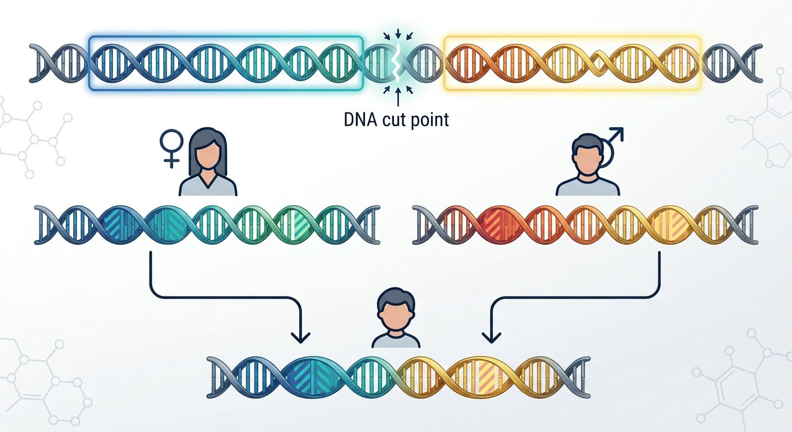

Recombination-cold blocks that are inherited as single units:

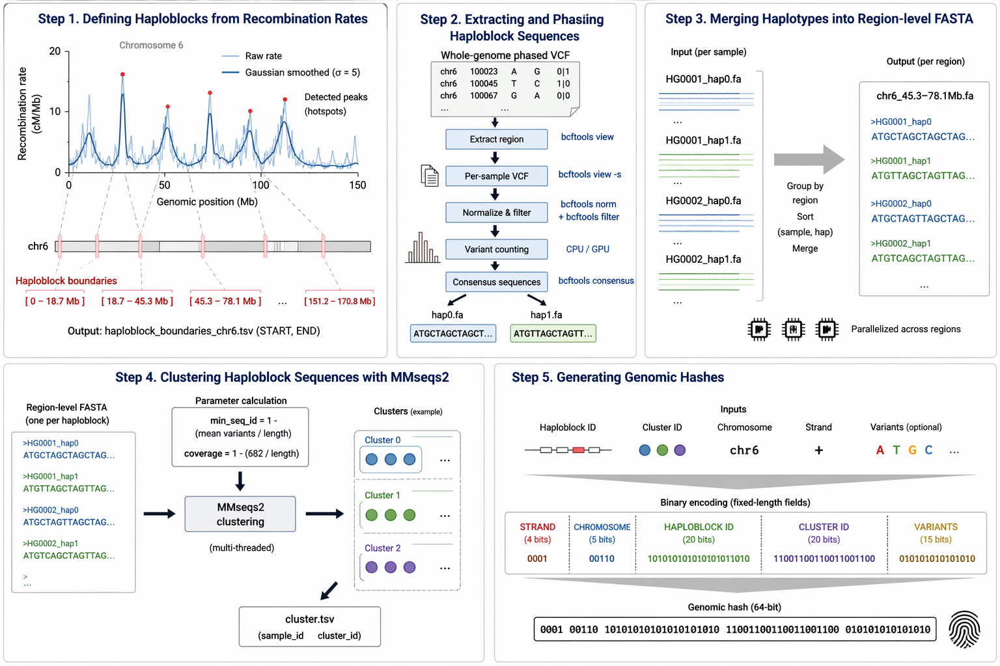

Phased haplotypes per block are merged into region-level FASTA and clustered with MMseqs2 — each cluster becomes one hash value:

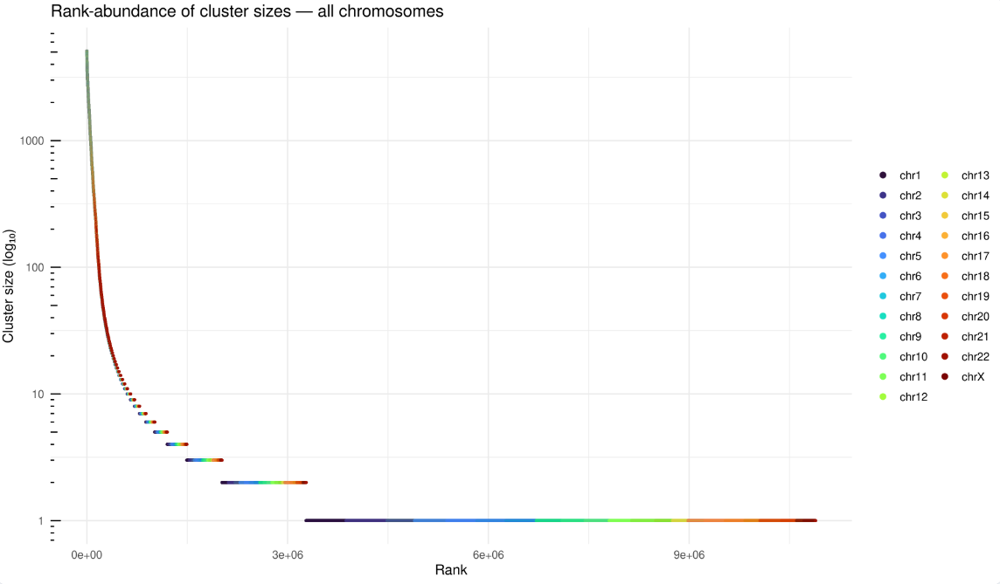

## What is AlphaGenome?

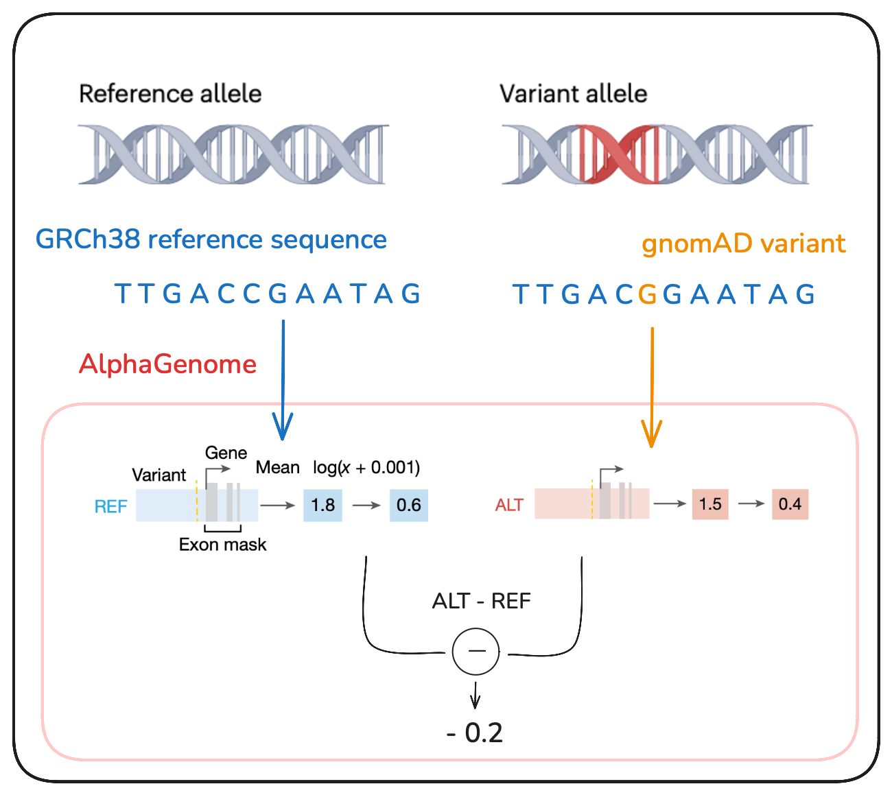

AlphaGenome reads the reference sequence plus one variant and predicts its impact on expression, splicing and regulation. **AVI** ranks every possible SNV genome-wide — PHRED 20 = "worse than 99% of all possible mutations".

## Does AVI match real biology?

Missing heritability lives in rare variants with large effects (Manolio et al., *Nature*):

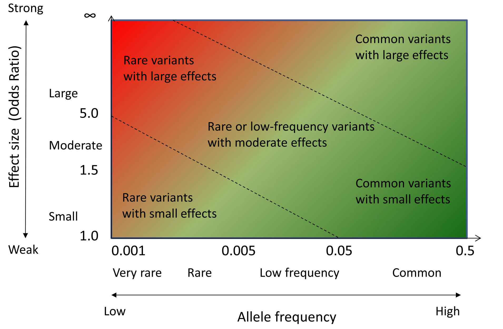

Consistency check — haploblocks ranked by AVI risk vs. real GTEx eQTLs:

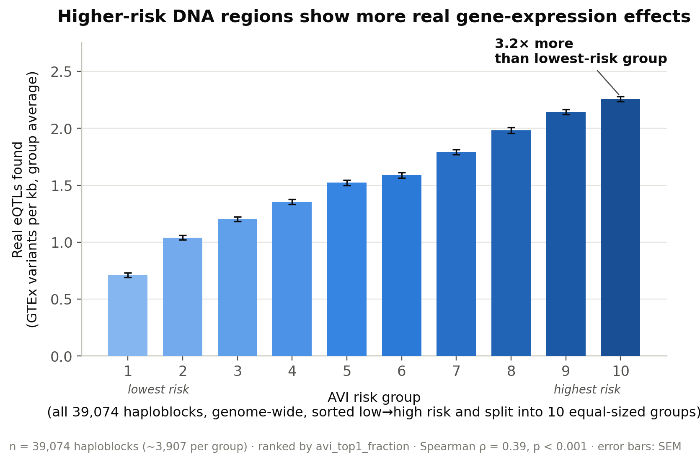

**Highest-risk blocks carry 3.2× more real eQTLs than lowest-risk blocks** — 39,074 haploblocks in 10 risk groups, Spearman ρ = 0.39, p < 0.001.

## Constraint vs AVI

Hypothesis: the most constrained haploblocks should be the most deleterious if mutated. We used AlphaGenome to screen perturbations across all blocks — including regions where no natural variation exists.

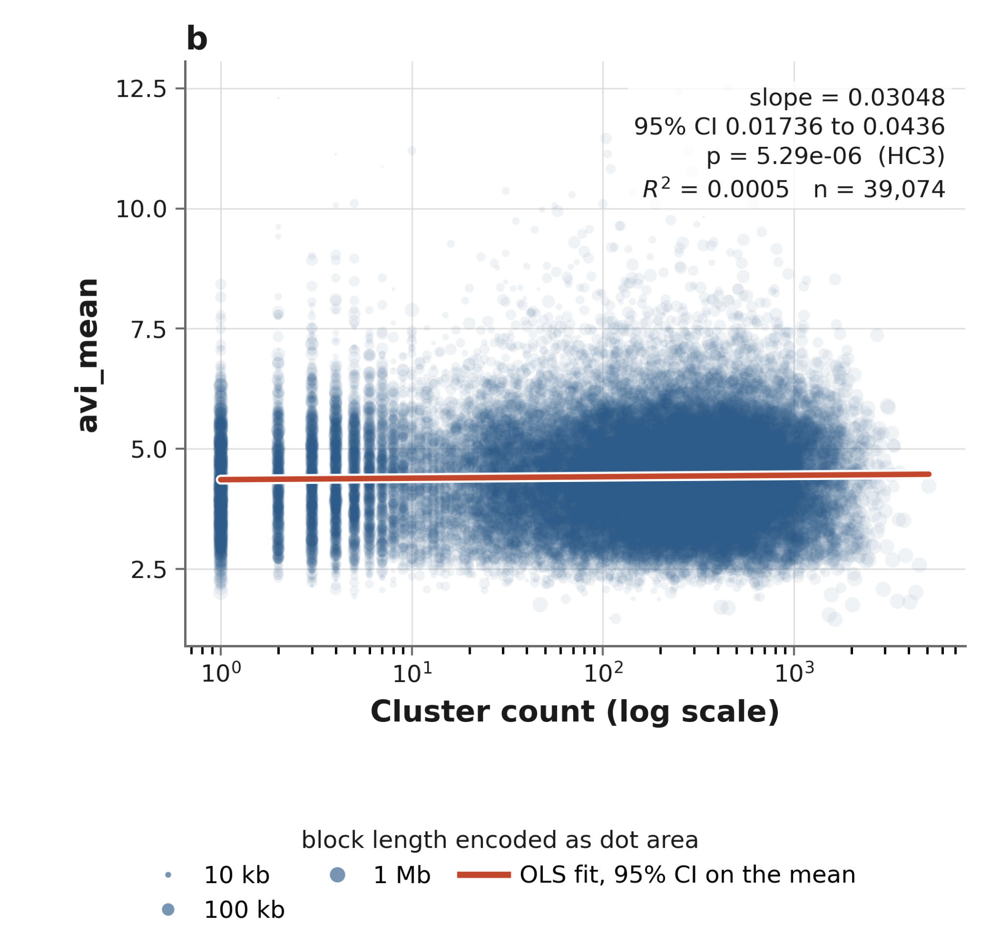
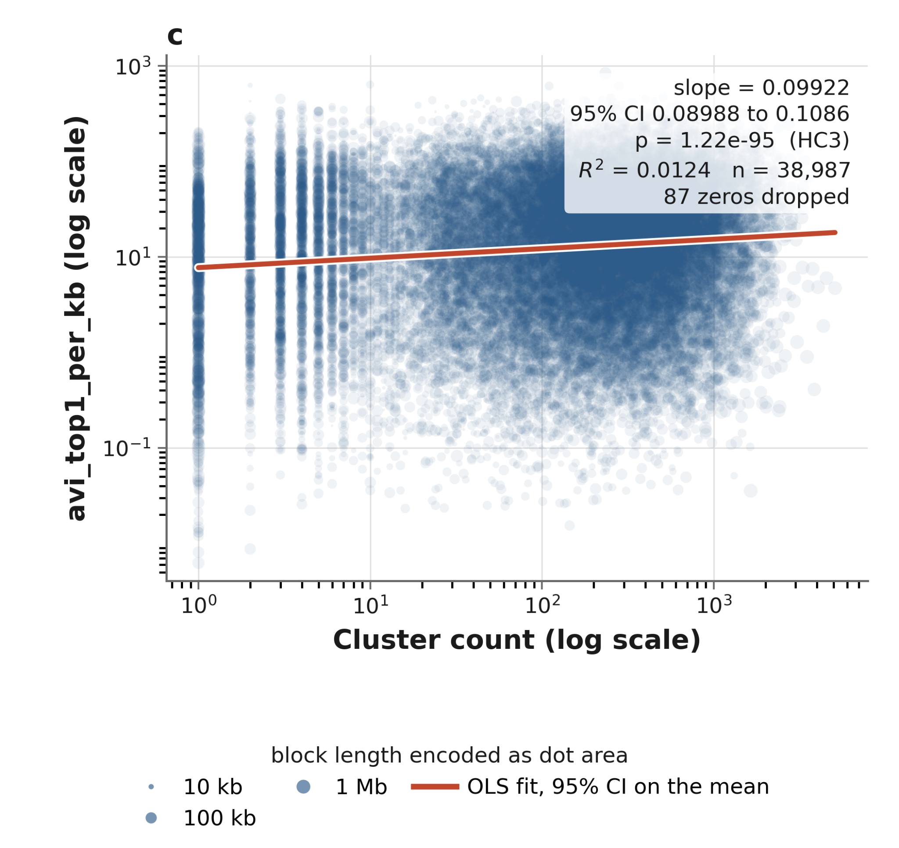

**Result: the opposite sign.** AVI rises with haplotype diversity, robust across every specification (+0.030, p = 5×10⁻⁶; +0.099, p = 10⁻⁹⁵) — likely an allele-frequency artifact: AlphaGenome is least reliable exactly where empirical variation is absent.

## Biological annotations

GO enrichment on genes overlapping the blocks (dot size = count, colour = p.adj, x = GeneRatio):

| Molecular function | Biological process | Cellular component |
|---|---|---|
| 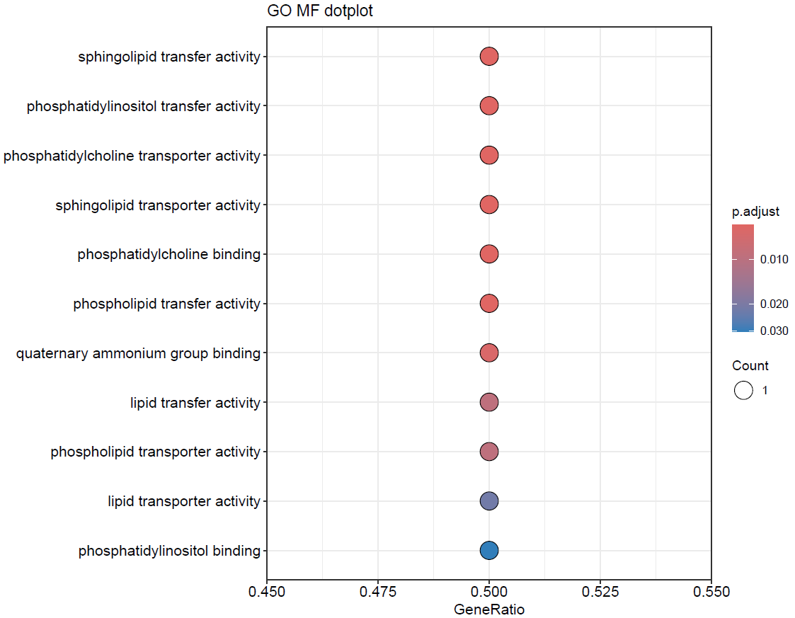 | 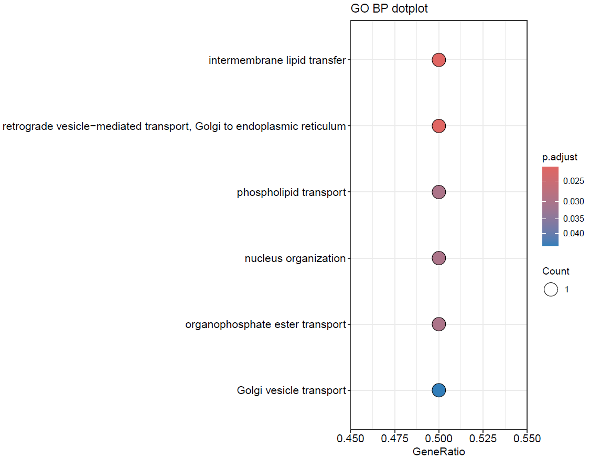 | 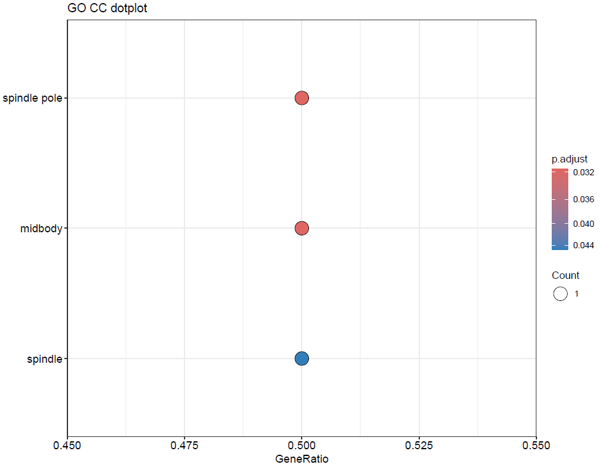 |

Example block — **chr22:27,840,691–28,224,919** (PITPNB, TTC28 · 60 transcript isoforms):

- GO BP / MF: 6 / 11 significant terms — all PITPNB, lipid transport
- GO CC: 3 significant terms — all TTC28, mitotic spindle
- Reactome: 3 pathways — phospholipid / PI metabolism
- ⚠️ all hits driven by a single gene — interpret cautiously

## Hashing & privacy

Each (block, cluster) pair encodes to one 64-bit word — strand, chromosome, haploblock, cluster, variants, AVI:

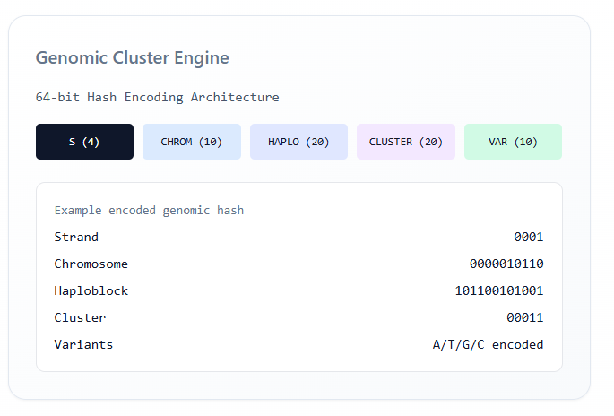

| Field | Bits | Values |
|---|---|---|
| strand | 1 | hap1 / hap2 |
| chrom | 5 | 1–24 |
| block | 16 | 0–65,535 |
| cluster | 13 | 0–8,191 |
| variants | 10 | 0–1,023 |
| avi | 8 | quantised PHRED |
| reserved | 11 | — |
| **total** | **64** | **53 used** |

**Re-identification exposure** (a singleton cluster identifies a haplotype by one block alone):

| | |
|---|---|
| Singleton clusters genome-wide | 7.7 M |
| Blocks containing at least one singleton | 91.5% |
| Blocks at which the average person is a singleton | 3,027 |
| Suppressing the 5,000 most-exposed blocks | removes 50.8% of singletons |

**Mitigation — two orders of magnitude apart:**

| Strategy | Cost |
|---|---|
| Suppress whole blocks until no singletons remain | 91.5% of blocks lost |
| Per-cluster k-anonymity (k = 2) | **3.9% of the dataset suppressed** |

AVI scores and annotations stay block-level; no individual allele states are exposed.

## Repo map

| Folder | What |
|---|---|
| `annotate_atlas/` | AlphaGenome Atlas scoring, chr22 pilot QC, GTEx comparison |
| `intersect-constraint-AVI/` | constraint vs AVI analysis |
| `bio_annotations/` | GO / Reactome enrichment |
| `hash/` | 64-bit encoding (`haplohash.py`) |
| `reid/` | re-identification attack |

## Team

| Who | Track |
|---|---|
| Mauricio Moldes | block filtering, gene counts |
| Alejandra Caballero, Mina | annotation databases, pruning |
| Markus Marandi | AlphaGenome atlas |
| Robert Campbell, David Bonet | effect sizes (burden / SKAT / ACAT) |
| Aditya Kumar Karna | encoding, hashing, hash attack |

## Data

1000G — 2,548 individuals, 26 populations, [data.haploblocks.org](https://data.haploblocks.org). hg38, SNVs only. UKB pending.
