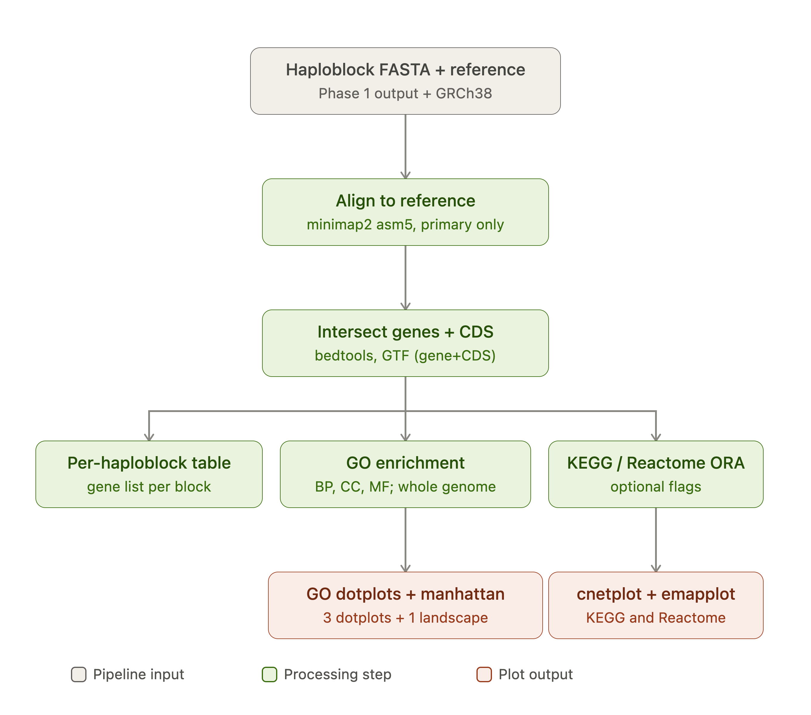

# HaploHash

Haploblock-level functional annotation + privacy-preserving genomic hashes. 16–18 Sep 2026.

```
39,141 haploblocks (hg38)   +   AlphaGenome Atlas | gnomAD
            \                          /
             \___ aggregate to block __/   top-1% statistic
                         |
               annotated haploblocks
                 /                \
           haplograph          64-bit hash
   nodes / edges / islands   S|CH:ROM|HAPLO|CLUSTER|VAR
      lift-weighted          re-identification attack
```





## Quality control
### Top 1 fraction


Each dot is one haploblock; height = what percent of all possible mutations inside it would land in that "worse than 99% of all mutations" tier.

### Strongest AVI score per block

 — same haploblocks; height = the single most disruptive possible mutation found anywhere inside that block.

### Distribution histogram divided into blocks

 

Across all 39,074 blocks, how many blocks have a little vs a lot of their mutation-space in that top-disruption tier. Each block gets sorted into one bucket based on "what % of its possible mutations are in the top-disruption tier" (same number as the y-axis in chart 1, just x-axis here). Bar height = how many blocks landed in that bucket.

The tallest bar, at the far left (0–0.2%), contains ~3,192 blocks — meaning most haploblocks have almost none of their mutation-space in the disruptive tier.

### Comparing chromosome AVI scores 

 

Top-disruption-tier percentage, averaged per chromosome, so we can compare chromosomes against each other.

* AVI is Atlas Variant Impact score, from AlphaGenome's Atlas model — for a single DNA letter change (SNV), it predicts how much that change would disrupt gene function (expression, splicing, regulation)

* PHRED - how that impact score is reported: a rank against every other possible mutation genome-wide. PHRED 20 means "this specific mutation's predicted impact is worse than 99% of all possible mutations" / "unusually disruptive."

## The problem

Genomic data sharing sits on a tension: block-level haplotype structure carries strong functional
signal (regulatory activity, constraint, burden), but that same structure is exactly what makes
individuals re-identifiable across datasets. Existing mitigations either strip out the functional
signal (allele-frequency scrubbing) or leave the haplotype structure intact and exploitable.
There's no compact representation that keeps the former while resisting the latter.

## The idea

Treat each of the 39,141 hg38 haploblocks as the unit of both annotation and encoding:

1. **Annotate** every block with functional scores (AlphaGenome Atlas activity, gnomAD constraint)
   aggregated with a top-1% statistic, so the signal reflects the most extreme regulatory/constraint
   element in the block rather than a diluted mean.
2. **Encode** each annotated block into a 64-bit hash (`S|CHROM|HAPLO|CLUSTER|VAR`) that represents
   haplotype identity without exposing raw variant-level data.
3. **Attack** the hash scheme ourselves — treat re-identification as the adversarial baseline the
   encoding has to survive, not an afterthought.

## Scientific question

Can block-level functional annotation (AlphaGenome Atlas + gnomAD) predict effect sizes at the
haplotype level, and can a compact 64-bit hash encode enough haplotype signal for downstream
analysis (burden/SKAT/ACAT) while remaining resistant to re-identification attacks?

## How it works

**Features per block**

| Feature | Source | Note |
|---|---|---|
| `avi_max`, `avi_top10_mean` | Atlas AVI, Tabix | strongest possible alternate alleles in the block |
| `avi_top1_count`, `avi_top1_fraction` | Atlas AVI, Tabix | number/fraction of alleles with PHRED >= 20 |
| `avi_top1_per_kb` | Atlas AVI, Tabix | top-1% allele density, adjusted for block length |
| `rnaseq_abs` | Atlas raw, API | signed — keep sum *and* abs |
| `gnocchi_mean` | gnomAD non-coding | positional, 1 kb |
| `loeuf_min` | gnomAD constraint | gene-joined; no gene = NA, not 0 |
| covariates | length, SNV density, coding fraction, genes |

Circular, excluded: PhastCons, Cactus, allele frequency (AVI inputs); recombination rate (defines
blocks).

**Data**: 1000G — 2,548 individuals, 26 populations, `data.haploblocks.org`. hg38, SNVs only. UKB
pending.

## How to use it

The end-to-end pipeline is **not ready yet**. What exists so far:

### `annotate_atlas/`

- Scrapes haploblock intervals from `data.haploblocks.org` into a sorted, overlap-checked
  `blocks.bed` (39,074 blocks recovered vs. 39,141 expected, hg38).
- `score_blocks.py` tabix-queries the AlphaGenome Atlas AVI PHRED scores per block, writing
  `block_scores.tsv` (`n_snv`, `avi_top1`, `avi_dens`, `length_kb`; PHRED ≥ 20, pooled, unsigned).
- **TODO**: AVI column indices need confirming against the real file once cluster VM access lands.

Downstream steps (haplograph construction, hash encoding, attack simulation, effect-size modeling)
are being built in parallel by the tracks below and are not yet wired together.

## Findings

## Findings

### Re-identification exposure

Computed from `block_stats.tsv`: 39,077 haploblocks, 5,096 haplotypes (2,548
individuals, 1000G). Code and full output in [`reid/`](reid/).

A haplotype that falls in a singleton cluster is uniquely identified by that
block alone, so exposure follows directly from the per-block cluster statistics
without running any assignment step.

| | |
|---|---|
| Singleton clusters genome-wide | 7,712,127 |
| Blocks containing at least one singleton | 35,740 of 39,077 (91.5%) |
| Mean blocks at which an individual is a singleton | 3,027 |

Re-identification is not a tail risk here. Every individual in the cohort is
uniquely identified at roughly three thousand blocks.

### Cost of mitigation

Two suppression strategies differ by two orders of magnitude in cost for the
same protection:

| Strategy | Cost |
|---|---|
| Suppress whole blocks until no singletons remain | 35,740 of 39,077 blocks (91.5%) |
| Suppress singleton clusters, retain the block | 7.7M of 199M haplotype-block observations (3.87%) |

Block-level suppression removes almost the entire dataset. Cluster-level
suppression removes 3.87% of observations and eliminates singleton exposure
entirely. This is the K=1 case; extending the cost curve to higher K requires
the full cluster size distribution rather than singleton counts alone.

### Structure

`n_clusters` correlates with `singleton_count` at +0.987, and at the median
block 61% of clusters contain exactly one haplotype. Cluster count is therefore
close to a direct measure of exposure. Entropy correlates at +0.774 and
dominance at −0.401.

### Caveat

The most exposed blocks are chr20:1-598702, chr12:1-599431, chr9:1-707077 and
chr16:42277286-46949080 — three telomeres and a centromere. chr20:1-598702 has
5,090 clusters across 5,096 haplotypes, meaning nearly every haplotype is
unique there. These are among the hardest regions in the genome to assemble, so
some of that apparent diversity may be technical rather than biological. The
headline figures would shift if these regions were excluded.


## Team

| Who | Track |
|---|---|
| Mauricio Moldes | block filtering, gene counts |
| Alejandra Caballero, Mina | annotation databases, pruning |
| Markus Marandi | AlphaGenome atlas |
| Robert Campbell, David Bonet | effect sizes (burden / SKAT / ACAT) |
| Aditya Kumar Karna | encoding, hashing, hash attack |

## Data

1000G — 2,548 individuals, 26 populations, `data.haploblocks.org`. hg38, SNVs only. UKB pending.

## annotate_atlas/

Scrapes haploblock intervals from data.haploblocks.org into a sorted, overlap-checked `blocks.bed` (39,074 blocks, hg38, vs ~39,141 expected). `score_blocks.py` streams the AlphaGenome Atlas AVI Tabix download across those intervals and writes one row per block. It validates the real file header or requires explicit column numbers; it does not silently assume that the last column is AVI PHRED.

Inspect the downloaded file first:

```bash
python3 annotate_atlas/score_blocks.py \
  annotate_atlas/blocks.bed /path/to/avi.tsv.gz --inspect
```

If the header identifies the AVI PHRED column, run:

```bash
python3 annotate_atlas/score_blocks.py \
  annotate_atlas/blocks.bed /path/to/avi.tsv.gz \
  annotate_atlas/block_scores.tsv
```

For a headerless file, pass 1-based column numbers reported by `--inspect`:

```bash
python3 annotate_atlas/score_blocks.py \
  annotate_atlas/blocks.bed /path/to/avi.tsv.gz \
  annotate_atlas/block_scores.tsv \
  --chrom-column 1 --position-column 2 --phred-column 6
```

The full static SNV Atlas contains roughly nine billion alternate alleles, so the genome-wide run belongs on the cluster and should read the local download, not the API.

### chr22 pilot QC

```bash
uv run --project annotate_atlas python annotate_atlas/qc_variant_parquet.py
```

Writes cleaned SNVs, excluded rows, and block counts to `annotate_atlas/qc/` for
the 12 pilot blocks. Retains distinct alleles with `AC>0`, joins blocks by
coordinates, and adds `AF_from_counts` and `MAF_from_counts`. Original AF and
missing AVI scores are kept and indels are checked separately.

### chr22 depletion baseline

```bash
uv run --project annotate_atlas python annotate_atlas/pilot_depletion.py
```

Writes a per-block TSV and two plots to `annotate_atlas/depletion/`.
Expected high-AVI alleles = observed scored SNVs × `avi_top1_count / n_scored`;
the pooled ratio is total observed / sum of block expectations. AVI ≥20 defines
high scores; unscored SNVs are omitted and undefined ratios are blank.
This is a uniform within-block baseline without mutation-context or callability
adjustment. The frequency plot uses AC/AN; AVI's frequency-based training makes
it a consistency check.

### GTEx eQTL comparison

```bash
GTEX_CONNECTIONS=4 bash annotate_atlas/gtex_run.sh /path/to/shared/storage/gtex
```

Downloads GTEx v8 results for all 49 tissues (about 185 GB before intermediates) and runs CPU jobs on Slurm `medium`.
Parallel downloads use `aria2c`; omit `GTEX_CONNECTIONS` to use `curl`.
Results go in `annotate_atlas/gtex/results/`; downloaded data and intermediates
are stored on shared storage and excluded from git. `tissues.tsv` lists the public source URLs.

Counts distinct tested autosomal SNVs, using GTEx's official significant-pair
calls. Compares the highest and lowest `avi_top1_fraction` quintiles after stratifying by
MAF, distance to the closest tested TSS, and number of genes tested. Lead variants
and fine-mapped variants (DAP-G PIP ≥0.5) are separate checks. Intervals use 1,000
bootstrap resamples of 5 Mb regions. These are descriptive associations; tissues
share donors and variants, and the intervals are not corrected for multiple comparisons.
`blood_sensitivity.tsv` checks finer covariate bins and exclusion of chromosome 6.

## From variant scores to haploblocks

There are two different outputs. Keep them separate.

### 1. Static block annotation

For block `h`, let `V_h` be every possible Atlas alternate allele whose hg38 position lies in the half-open block interval. `score_blocks.py` calculates:

```text
avi_max(h)           = max(q_v)
avi_top10_mean(h)    = mean(10 largest q_v)
avi_top1_count(h)    = sum(1[q_v >= 20])
avi_top1_fraction(h) = avi_top1_count / number of scored alleles
avi_top1_per_kb(h)   = avi_top1_count / block length in kb
```

Here `q_v` is AVI PHRED. PHRED 20 is the Atlas genome-wide top 1%. AVI is an unsigned prioritisation rank that mixes AlphaGenome predictions with conservation and coding features. A sum or mean of all AVI PHRED values is therefore not a signed block effect. The static annotation measures a block's *functional opportunity*: how many potentially important substitutions the interval contains.

### 2. Observed haplotype or cluster annotation

To annotate the genomic hashes, use only alleles carried by that phased haplotype:

```text
phased 1000G VCF
  -> split and left-normalise multiallelic records on hg38
  -> join each ALT by (chromosome, position, ALT) to Atlas
  -> assign the allele to one BED haploblock
  -> group by (sample, haplotype, block_id)
  -> join the existing haplotype-cluster ID
```

Useful per-haplotype features are `carried_avi_max`, `carried_top1_count`, and `carried_top1_fraction`. At cluster level, report the median member value and the fraction of cluster members carrying at least one PHRED >= 20 allele. Do not copy the static block score onto every cluster and call it a genotype effect: that loses the individual's allele state.

### Direction and interactions

AVI cannot say whether a haplotype increases or decreases expression. For a phenotype-specific analysis, query non-active, signed Atlas modalities (for example RNA-seq, CAGE or accessibility), select the relevant tissues and genes, take the maximum absolute score across the selected tracks for filtering, and retain the original sign for burden models. This follows the Atlas paper's aggregate-testing design.

The precomputed Atlas rows score one variant at a time. Summing carried single-variant scores assumes no within-block interaction. For selected blocks shorter than AlphaGenome's 1 Mb input, score the complete phased sequence with the AlphaGenome haplotype workflow and compare it with the single-variant results:

```text
non_additivity(h) = score(combined haplotype) - sum(score(single variants))
```

That combined prediction is a second-stage analysis, not something recoverable from the AVI download alone.
